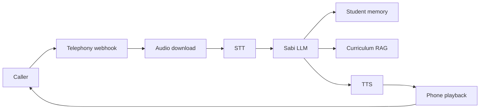

# Sabi Server

Private self-hosted voice AI server for Sabi, the phone-call tutor built by Education for Equality.

This backend is the low-latency telephony stack: speech-to-text, curriculum-aware tutoring, memory, text-to-speech, and phone call orchestration.

## What it does

- Handles Africa's Talking, Twilio, and Asterisk/SIP call flows.
- Runs speech-to-text over local Whisper / faster paths when configured.
- Generates tutoring responses with provider fallback: Cerebras, Claude, Groq, or Ollama.
- Pulls student memory from Supabase.
- Speaks responses through Chatterbox, YarnGPT, or configured TTS fallback.
- Streams LLM sentences into TTS to reduce time to first audio.
- Maintains active call history and wraps up long lessons naturally.

## Architecture



## Key files

- `main.py` - FastAPI app, model startup, middleware, mounted routers
- `voice.py` - Africa's Talking call flow
- `voice_twilio.py` - Twilio call flow
- `voice_asterisk.py` - Asterisk FastAGI path
- `llm.py` - tutor prompt and LLM provider fallback
- `memory.py` - Supabase-backed student memory
- `stt.py` and `tts.py` - speech interfaces
- `answer_matcher.py` - answer matching utilities

## Run locally

```bash
pip install -r requirements.txt
uvicorn main:app --host 0.0.0.0 --port 8000
```

Use local/development environment variables only. Production secrets must stay out of git.

## Privacy

Keep this repository private. It contains production-sensitive telephony architecture and company IP for Sabi.
